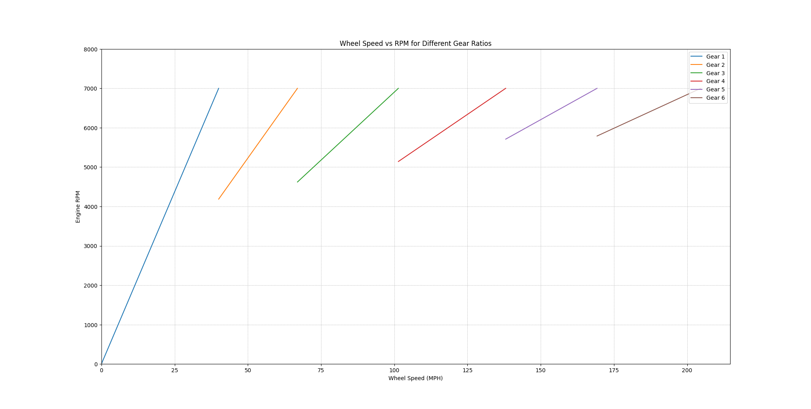

# Shift Plotter
 A quick and dirty graph visualization for what RPMs each gear shift would lead to.

 Useful for cross shopping cars (think E9x M3 DCT vs 6MT), debating transmission options in a swap, or even final drive changes on your project car.

### Command Line Args

* `--save "filename.gml"`: Save the output of the plot to a gml file to be opened later. While you can just take a screenshot or save using MatPlotLib's GUI, you lose the functionality of knowing exactly where on the plot you are using your mouse.

* `--open "filename.gml"`: Open a previously made file.

### Plot Example
